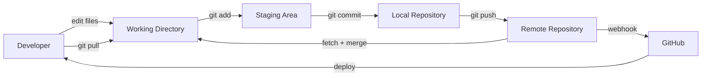
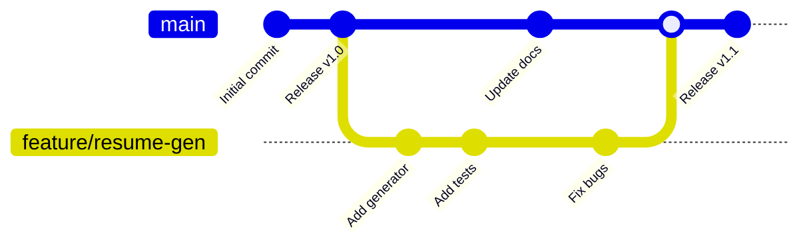

# 2️⃣ Git Workflows — Version Control Mastery

**Module Duration:** 45 minutes  
**Difficulty:** Intermediate  
**Prerequisites:** [ARCHITECTURE.md](./ARCHITECTURE.md)

---

## 🎯 What You'll Learn

- ✅ Git commands for daily development
- ✅ Branching strategies (GitFlow, GitHub Flow)
- ✅ Commit best practices and atomic commits
- ✅ Pull request workflow and code review
- ✅ Merge conflict resolution
- ✅ Rebasing vs. merging
- ✅ Git history navigation (log, blame, bisect)

---

## 📊 Git Workflow Diagram



---

## 🔄 Daily Git Workflow (5 Commands)

### **Step 1: Create Feature Branch**
```bash
git checkout -b feature/resume-templates
# Creates and checks out new branch from main
```

### **Step 2: Make Changes**
```bash
# Edit files in VS Code
echo "New resume template" >> resume.template
```

### **Step 3: Stage Changes**
```bash
git add .
# Or add specific files:
git add resume.template
```

### **Step 4: Commit with Clear Message**
```bash
git commit -m "Add resume template for SRE roles"
# Good message format: verb + noun + context
```

### **Step 5: Push and Create PR**
```bash
git push origin feature/resume-templates
# Then create Pull Request on GitHub for review
```

---

## 📝 Commit Message Best Practices

### **Format: \`<type>: <subject>\`**

```
<type>: <subject>
<BLANK LINE>
<body>
<BLANK LINE>
<footer>
```

### **Types:**
- `feat:` New feature
- `fix:` Bug fix
- `docs:` Documentation
- `style:` Formatting (no code change)
- `refactor:` Code restructuring
- `perf:` Performance improvement
- `test:` Adding tests
- `chore:` Maintenance tasks

### **Examples:**

❌ **Bad:**
```
fixed stuff
updated files
resume generator
```

✅ **Good:**
```
feat: Add Node.js resume generator with docx/pdf export

- Implement template system for role-specific resumes
- Add docx and pdfkit integration
- Support JD keyword extraction and matching

Fixes #42
```

✅ **Good (Simple):**
```
docs: Update Git workflow documentation

Add section on merge conflict resolution
```

---

## 🌳 Branching Strategies

### **GitHub Flow (Recommended for This Project)**



**Flow:**
1. Create feature branch from `main`
2. Commit changes on feature branch
3. Open Pull Request for review
4. After approval, merge to `main`
5. Deploy from `main`

### **GitFlow (For Larger Projects)**

```
main (production-ready)
  ↓
develop (integration branch)
  ├─ feature/resume-gen → develop
  ├─ feature/portfolio → develop
  ├─ bugfix/sync-script → develop
  ↓
release/v1.0 (release prep)
  ↓
main (tag v1.0)
  ├─ hotfix/critical-bug → main
  ├─ hotfix/critical-bug → develop
  ↓
develop
```

**For This Project:** Use GitHub Flow (simpler for solo/small team)

---

## 🔀 Merging vs. Rebasing

### **Merge (Recommended for Main Integration)**

```
main:    A -- B -------- M (merge commit)
              \        /
feature:       C -- D
```

**Command:**
```bash
git checkout main
git pull origin main
git merge feature/resume-gen
git push origin main
```

**Pros:**
- Preserves history
- Easy to revert
- Shows when features were integrated

**Cons:**
- Creates merge commits
- History can get messy

### **Rebase (Use in Feature Branches)**

```
main:    A -- B -- C
              \
feature:      D' -- E' (rebased commits)
```

**Command:**
```bash
git checkout feature/resume-gen
git rebase main
# Fix conflicts if any
git push --force origin feature/resume-gen
```

**Pros:**
- Linear history
- Easier to read
- Cleaner git log

**Cons:**
- Rewrites commit history
- Don't use on shared branches

---

## ⚠️ Resolving Merge Conflicts

### **Scenario: Conflict on merge**

```bash
$ git merge feature/portfolio
CONFLICT (content): Merge conflict in resume.md
Auto-merging resume.md
CONFLICT (add/delete): script.ps1 deleted by us.
Automatic merge failed; fix conflicts and then commit.
```

### **File Shows Conflict Markers:**

```markdown
# Resume

<<<<<<< HEAD (current branch)
## Skills (Main version)
- Python
- Docker
=======
## Competencies (Feature version)
- Python
- Kubernetes
>>>>>>> feature/portfolio
```

### **Resolution Steps:**

**Step 1: Identify conflicts**
```bash
git status
# Shows conflicted files
```

**Step 2: Edit conflicted files**
```bash
# Remove conflict markers, keep desired content
# In VS Code: Use merge conflict UI (better than manual)
```

**Step 3: Stage resolved files**
```bash
git add resume.md script.ps1
```

**Step 4: Complete merge**
```bash
git commit -m "Merge feature/portfolio: resolve conflicts"
```

**Better: Use VS Code**
- VS Code shows "Accept Current | Accept Incoming | Accept Both"
- Choose which version to keep
- Automatic staging

---

## 📊 Git Log Navigation

### **View Commit History**
```bash
# One line per commit
git log --oneline

# With graph (branches)
git log --oneline --graph --all

# With author and date
git log --oneline --decorate --graph --all

# Last 5 commits
git log -5

# By date range
git log --since="2 weeks ago" --until="now"
```

### **Find Specific Changes**
```bash
# What changed in a commit
git show <commit-hash>

# Who changed each line (blame)
git blame resume.md

# Search commit messages
git log --grep="resume" --oneline

# Search by author
git log --author="Rajesh" --oneline
```

### **Bisect: Find Bug-Introducing Commit**
```bash
git bisect start
git bisect bad                    # Current version is broken
git bisect good v1.0              # Last known good version

# Git checks out middle commit
# Test it: is it broken or good?
git bisect bad                   # Mark as broken
# Git narrows down...
# Eventually finds the exact commit that broke it
```

---

## 🔧 Advanced Git Scenarios

### **Scenario 1: Undo Last Commit (Didn't Push Yet)**
```bash
git reset --soft HEAD~1
# Changes stay staged, commit undone
# Or: git revert if commit is already pushed
```

### **Scenario 2: Recover Deleted Branch**
```bash
git reflog
# Find the commit hash
git checkout -b recovered-branch <commit-hash>
```

### **Scenario 3: Stash Work in Progress**
```bash
git stash
# Work on another branch
git stash pop
# Resume work
```

### **Scenario 4: Cherry-Pick Commit from Another Branch**
```bash
git cherry-pick <commit-hash>
# Applies specific commit to current branch
```

---

## 🎯 Interview Question: "Explain Your Git Workflow"

**Your Answer (2-3 minutes):**

"I use **GitHub Flow** for this project with the following workflow:

**Day-to-Day:**
1. Create feature branch from main: `git checkout -b feature/resume-gen`
2. Make atomic commits with clear messages: `git commit -m 'feat: Add docx export'`
3. Push to GitHub: `git push origin feature/resume-gen`
4. Open Pull Request for code review
5. After approval, merge to main and deploy

**Key Practices:**
- **Atomic commits:** Each commit is a single logical change (can be reverted independently)
- **Clear messages:** Follows `type: subject` format (feat, fix, docs, etc.)
- **Branching:** Separate branch per feature, easy to abandon or iterate
- **Merge strategy:** Use merge commits (preserve history) for main integration

**Conflict Resolution:**
- If conflicts arise during merge, I resolve them in VS Code using the UI
- Then stage resolved files and complete the merge
- I've used git bisect to find bug-introducing commits in large histories

**For 27 Repos:**
My PowerShell script uses git commands programmatically:
```powershell
git -C $repo fetch origin
git -C $repo pull origin main
```

This ensures all repos stay in sync automatically."

---

## 📋 Git Commands Cheat Sheet

| Command | Purpose |
|---------|---------|
| `git clone <url>` | Copy repository |
| `git branch -a` | List all branches |
| `git checkout -b name` | Create and switch to branch |
| `git add .` | Stage all changes |
| `git commit -m "msg"` | Save changes locally |
| `git push origin main` | Send to GitHub |
| `git pull origin main` | Fetch and merge updates |
| `git merge feature` | Merge branch to current |
| `git rebase main` | Rebase current on main |
| `git log --oneline` | Show commit history |
| `git status` | Show working directory status |
| `git diff` | Show unstaged changes |
| `git stash` | Temporarily save changes |
| `git reset --soft HEAD~1` | Undo last commit |
| `git blame file.txt` | Show who changed each line |

---

## 🚀 Next Module

**→ [3-SCRIPTING-AUTOMATION.md](./3-SCRIPTING-AUTOMATION.md)** — Learn PowerShell automation and error handling

---

**Completed:** Git workflows, branching, commits, merging, conflict resolution  
**Next Up:** PowerShell scripting for repository automation
