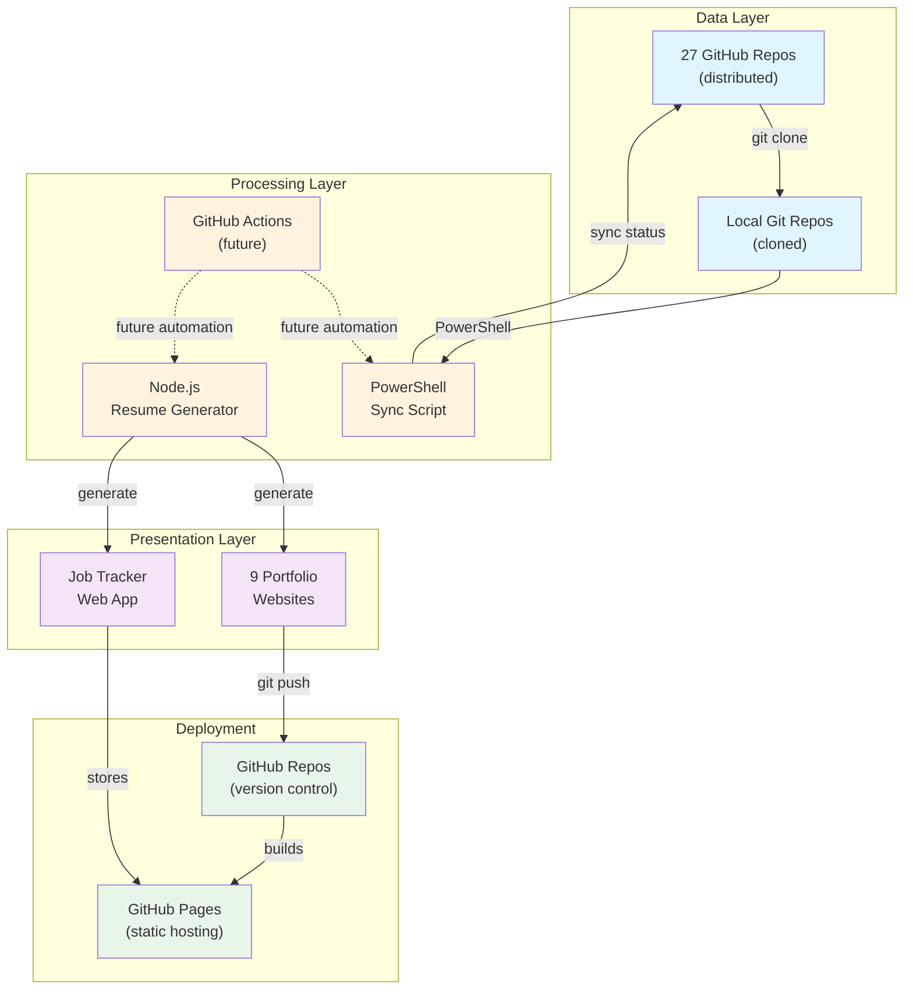
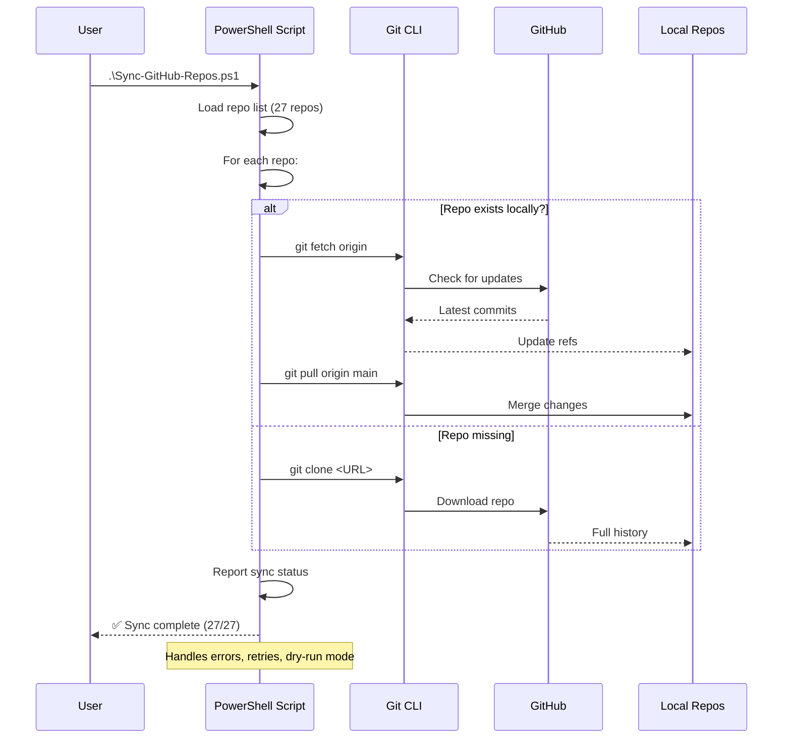
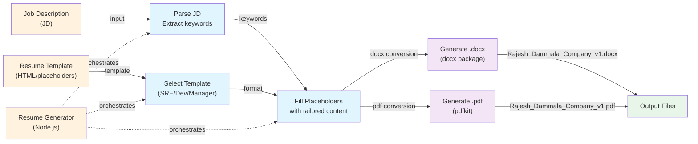
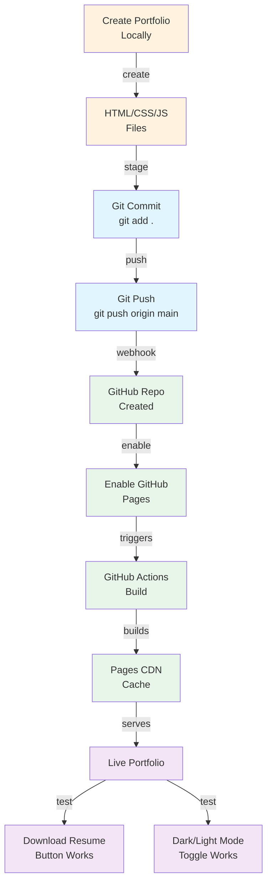
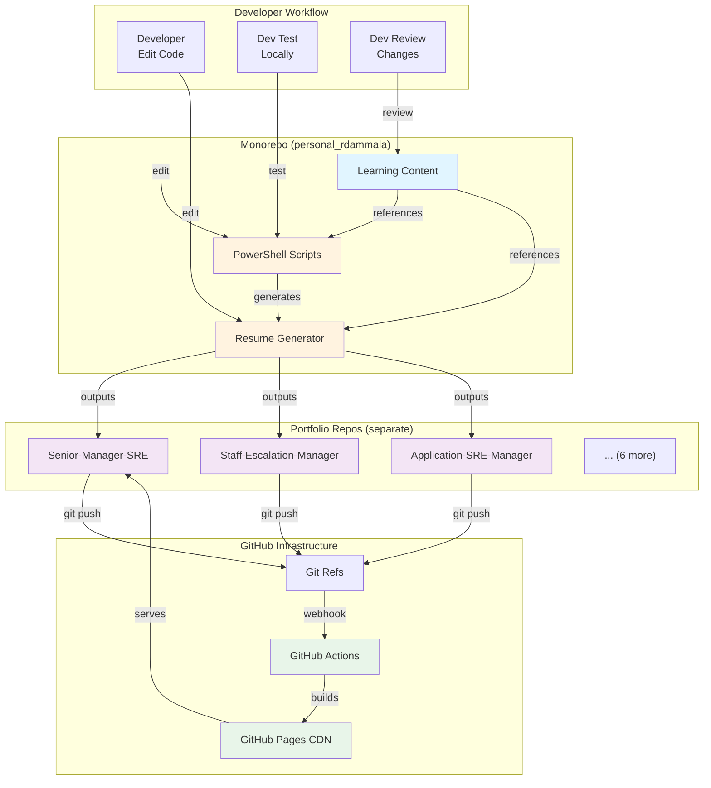
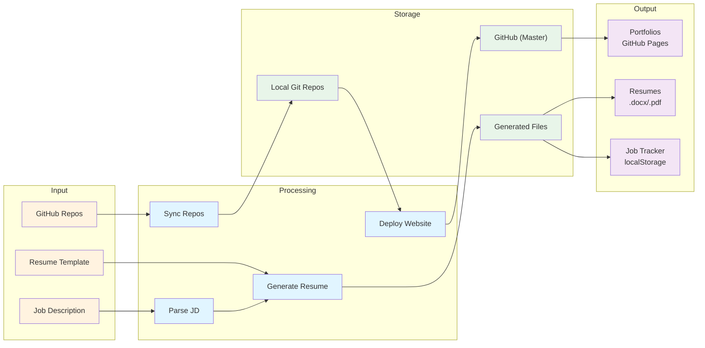
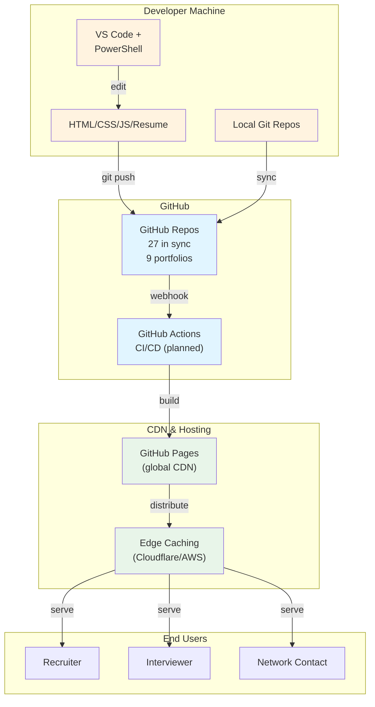
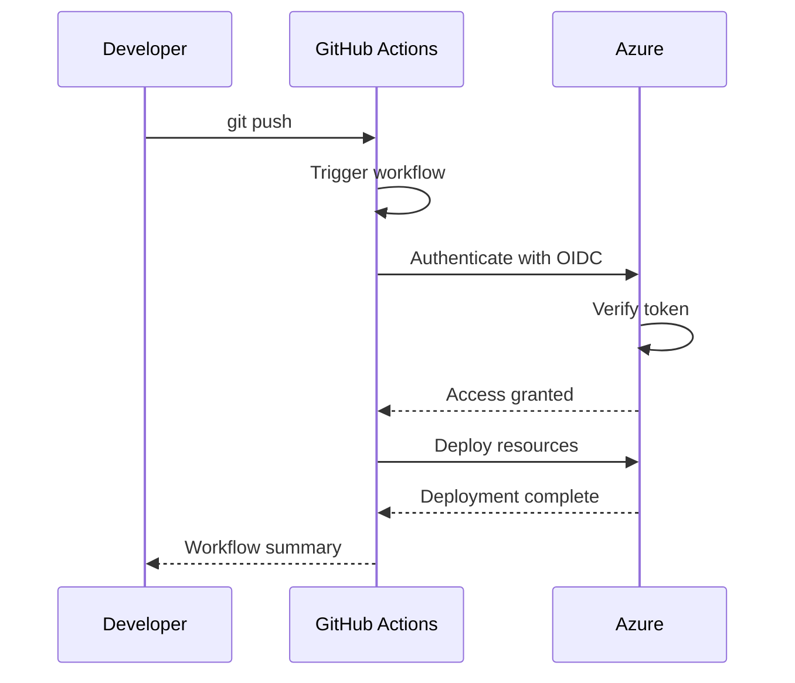

# 🏗️ Architecture — System Design & Mermaid Diagrams

**Module Duration:** 25 minutes  
**Difficulty:** Intermediate  
**Prerequisites:** [0-PROJECT-OVERVIEW.md](./0-PROJECT-OVERVIEW.md), [1-REPOSITORY-STRUCTURE.md](./1-REPOSITORY-STRUCTURE.md)

---

## 🎯 System Architecture Overview

The personal_rdammala project follows a **multi-tier architecture** combining:
1. **Data Tier** — GitHub repositories (distributed, version-controlled)
2. **Processing Tier** — Automation scripts (PowerShell, Node.js)
3. **Presentation Tier** — Web portfolios (HTML/CSS/JS on GitHub Pages)
4. **Tracking Tier** — Job tracker (localStorage-based)

---

## 📊 Mermaid Diagram 1: High-Level System Architecture



**Reading Guide:**
- 🔵 **Blue**: Data repositories (GitHub repos)
- 🟠 **Orange**: Processing (automation)
- 🟣 **Purple**: Presentation (user-facing)
- 🟢 **Green**: Deployment/hosting

---

## 📊 Mermaid Diagram 2: Repository Sync Flow



**Key Features:**
- **Idempotent:** Safe to run multiple times
- **Error Recovery:** Retry logic on network failures
- **Dry-Run Mode:** Preview changes without making them
- **Status Reporting:** Clear success/failure messages

---

## 📊 Mermaid Diagram 3: Resume Generation Pipeline



**Templating Pattern:**
```
Template: "Skills in {{TECHNOLOGY}} and {{METHODOLOGY}}"
JD: "Python, Docker, Kubernetes..."
Output: "Skills in Python, Docker, Kubernetes and DevOps practices"
```

---

## 📊 Mermaid Diagram 4: Portfolio Deployment Flow



**Timing:**
- Commit to GitHub: <1 second
- GitHub Actions build: 30-60 seconds
- CDN cache update: 1-2 minutes
- Full availability: <3 minutes

---

## 📊 Mermaid Diagram 5: Job Application Tracker State Machine

```mermaid
stateDiagram-v2
    [*] --> ApplicationForm
    
    ApplicationForm --> Added: Fill form<br/>Submit
    Added --> Applied: Send application
    Applied --> Reviewing: Recruiter screens
    
    Reviewing --> Interview: Pass screen
    Reviewing --> Rejected: Rejected
    Rejected --> [*]
    
    Interview --> PhoneInterview: Initial call
    Interview --> TechnicalInterview: Tech assessment
    
    PhoneInterview --> TechnicalInterview
    TechnicalInterview --> Interview2: Second round
    Interview2 --> Interview3: Final round
    
    Interview3 --> Offer: Receive offer
    Interview3 --> Rejected
    Offer --> Negotiating: Negotiate salary
    Negotiating --> Accepted: Accept offer
    Negotiating --> Declined: Decline offer
    Accepted --> [*]
    Declined --> [*]
    
    note right of Added
        Stored in localStorage
        + optional cloud sync
    end
    
    note right of Negotiating
        Can track counter-offers,
        start dates, benefits
    end
```

---

## 📊 Mermaid Diagram 6: Component Interaction Diagram



---

## 📊 Mermaid Diagram 7: Data Flow Architecture



---

## 🔗 Data Flow Examples

### **Example 1: Applying to a Job**

```
User Input (Job URL)
    ↓
Job Application Tracker
    ↓ (stores)
localStorage on browser
    ↓ (manual sync)
Job_Application_Tracker.html copied to
    ↓
career-focus-pages repo
    ↓ (git push)
GitHub repo
    ↓ (automatic build)
GitHub Pages
    ↓ (served)
Live tracker at https://rdammala.github.io/career-focus-pages/
```

### **Example 2: Syncing 27 Repos**

```
PowerShell Script (.ps1 file)
    ↓ (reads config)
27 GitHub repo URLs
    ↓ (for each repo)
    ├─ Check if exists locally
    ├─ If missing: git clone
    ├─ If exists: git fetch + git pull
    ↓ (loops through all)
Local sync complete
    ↓
Status report (✅ 27/27 synced)
```

### **Example 3: Creating a Portfolio**

```
Resume PDF + Role name
    ↓
Clone portfolio template
    ↓
Customize HTML/CSS/JS
    ↓
Add resume PDF + favicon
    ↓ (git add . && git commit && git push)
Push to GitHub
    ↓ (webhook triggers)
GitHub Actions build
    ↓ (deploys to Pages)
Live at: https://rdammala.github.io/<RoleName>/
```

---

## 🏢 Deployment Architecture



---

## 🔐 Security Architecture

### **Data Protection**

| Layer | Protection | Implementation |
|-------|-----------|-----------------|
| **Repos** | Public (portfolio), Private (tools) | GitHub visibility settings |
| **Resume** | Specific sharing | Manual control (.pdf in repo) |
| **Job Tracker** | Client-side storage | localStorage (no server) |
| **Secrets** | Not stored | Manual entry during generation |

### **Authentication Flow** (Future with GitHub Actions)



---

## 🎯 Architecture Interview Questions

### **Q: "Explain your system architecture"**

**Answer:**
"My architecture is a **four-tier system**:

1. **Data Tier:** 27 GitHub repositories distributed across monorepo and portfolio repos
2. **Processing Tier:** PowerShell scripts for repo sync, Node.js for resume generation
3. **Presentation Tier:** 9 HTML/CSS/JS portfolio websites deployed to GitHub Pages
4. **Tracking Tier:** Browser-based job tracker using localStorage

The key flows:
- **Sync:** PowerShell script fetches/pulls 27 repos in <2 minutes
- **Generate:** Node.js creates tailored .docx/.pdf from templates
- **Deploy:** Git push → GitHub → Actions build → GitHub Pages live

All components are loosely coupled through Git and GitHub. Future enhancements: GitHub Actions for CI-CD automation, cloud storage for tracking data."

### **Q: "How do you handle scaling?"**

**Answer:**
"Currently optimized for personal use (27 repos, 1 person). For scaling:

- **Repos:** Monorepo strategy can handle 100+ repos with better filtering
- **Resume Generation:** Switch from Node.js to microservice (serverless function)
- **Portfolios:** Automated template system (now manual)
- **Tracking:** Move from localStorage to cloud database (Firebase/Cosmos DB)
- **CI-CD:** GitHub Actions can parallelize builds across multiple portfolios"

### **Q: "What are your single points of failure?"**

**Answer:**
"Current SPOFs:
1. **GitHub as single provider** → Mitigate: Backup repos to GitLab/Azure DevOps
2. **Resume template breaking** → Mitigate: Version control templates, test generation
3. **localStorage data loss** → Mitigate: Regular exports, cloud backup
4. **Monorepo too large** → Mitigate: Split into multiple repos if >100 items

Future: Multi-cloud deployment for resilience."

---

## 🚀 Next Module

**→ [2-GIT-WORKFLOWS.md](./2-GIT-WORKFLOWS.md)** — Learn Git commands, branching strategies, and conflict resolution

---

**Completed:** Understanding system architecture with 7 Mermaid diagrams  
**Next Up:** Git workflows and version control best practices
